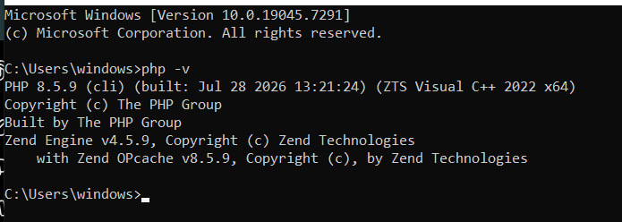
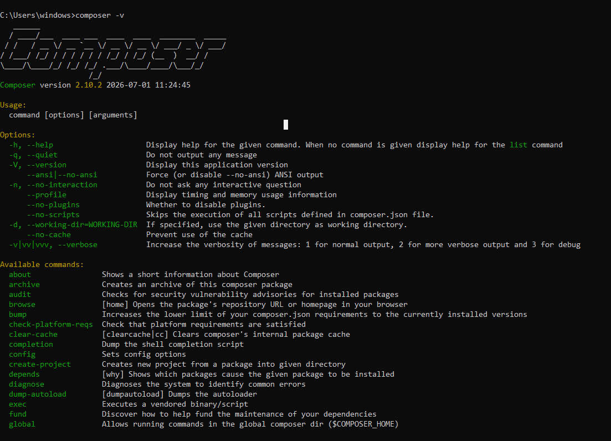
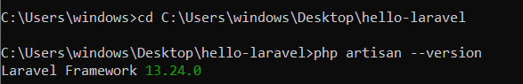
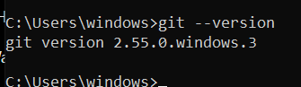
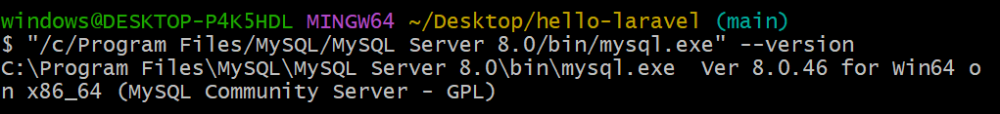
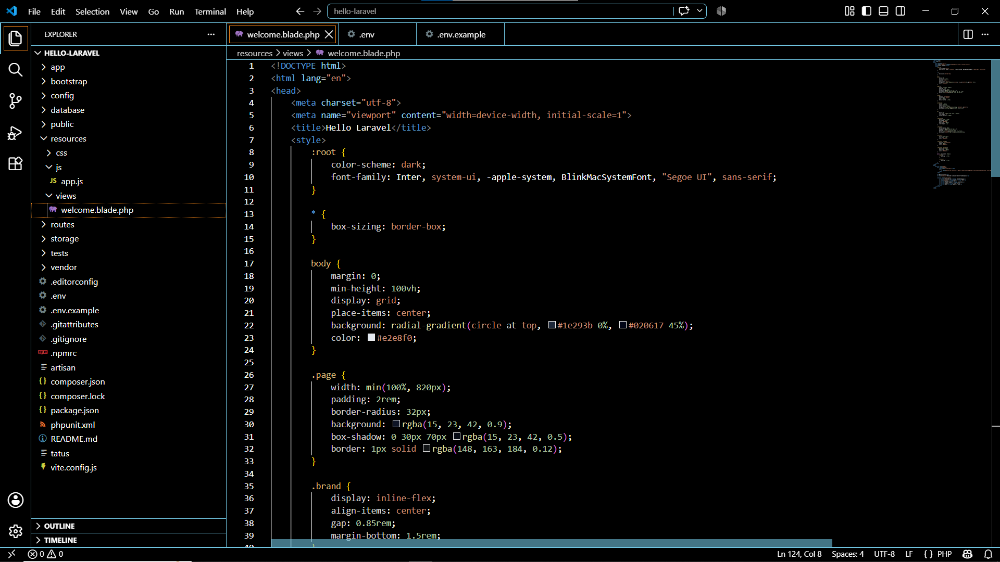
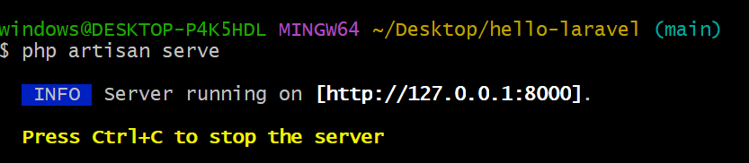
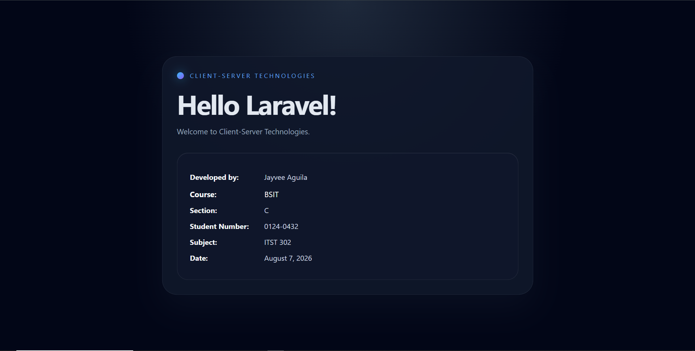
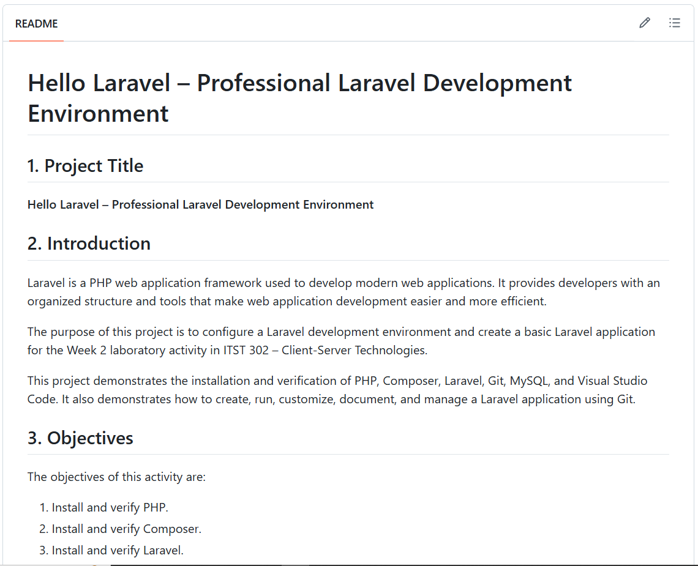

# Hello Laravel – Client-Server Technologies

## 1. Project Title

# Hello Laravel

**Week 2 – Laravel Development Environment**

**ITST 302 – Client-Server Technologies**

---

## 2. Introduction

### Brief Overview of Laravel

Laravel is a PHP web application framework used to build modern web applications. It provides developers with tools for routing, database management, views, and other common web development tasks.

### Importance of Client-Server Technologies

Client-Server Technologies are important because they explain how clients communicate with servers to request and receive information. Web applications use this architecture to allow users to interact with applications while servers process requests and communicate with databases.

### Purpose of the Project

The purpose of this project is to set up a complete Laravel development environment and create a basic Laravel application.

This activity demonstrates the installation and verification of PHP, Composer, Laravel, Git, MySQL, and Visual Studio Code. It also demonstrates how to create a Laravel project, run it locally, modify the homepage, and push the completed project to GitHub.

---

# 3. Install PHP

PHP is required because Laravel is a PHP-based web application framework.

After installing PHP, the installation was verified through Git Bash using the following command:

```bash
php -v
```

The command displays the PHP version installed on the computer.

### PHP Installation Verification



**What the screenshot shows:**

The screenshot shows the PHP version information displayed in Git Bash after executing `php -v`. This confirms that PHP is installed correctly and that the PHP command can be accessed through the terminal.

---

# 4. Install Composer

Composer is the dependency manager used by PHP projects. Laravel uses Composer to install packages and create Laravel applications.

After installing Composer, the installation was verified using:

```bash
composer -V
```

### Composer Installation Verification



**What the screenshot shows:**

The screenshot shows the Composer version displayed in Git Bash. This confirms that Composer is installed correctly and available through the command line.

Composer is important for Laravel because it manages Laravel's PHP dependencies and allows developers to create Laravel projects.

---

# 5. Install Laravel

Laravel was installed as the web application framework used for this project.

The Laravel installation was verified using:

```bash
laravel -V
```

Another way to verify the Laravel installer is:

```bash
composer global show laravel/installer
```

### Laravel Installation Verification



**What the screenshot shows:**

The screenshot shows the Laravel installer version displayed in Git Bash. This confirms that the Laravel development tools are installed and available for creating Laravel applications.

---

# 6. Install Git

Git is a version control system used to track changes to project files.

After installing Git, the installation was verified using:

```bash
git --version
```

### Git Installation Verification



**What the screenshot shows:**

The screenshot shows the Git version displayed in Git Bash. This confirms that Git is installed and can be used for version control.

Git was later used to commit the Laravel project and push it to GitHub.

---

# 7. Install MySQL

MySQL was installed as the database management system for the development environment.

The MySQL installation was verified using:

```bash
mysql --version
```

### MySQL Installation Verification



**What the screenshot shows:**

The screenshot shows the MySQL version information displayed in Git Bash. This confirms that MySQL is installed and accessible through the command line.

MySQL can be used as the database server for Laravel applications.

---

# 8. Install Visual Studio Code

Visual Studio Code was used as the code editor for developing the Laravel application.

After installing Visual Studio Code, the Laravel project was opened in the editor.

### Laravel Project in Visual Studio Code



**What the screenshot shows:**

The screenshot shows the `hello-laravel` project opened in Visual Studio Code. The Laravel project files and folders can be viewed in the editor, allowing the application code to be created and modified.

Visual Studio Code was used throughout the development process to edit and manage the Laravel project.

---

# 9. Create Laravel Project

After preparing the development environment, a new Laravel project was created.

The project was created using Composer with the following command:

```bash
composer create-project laravel/laravel hello-laravel
```

The project name is:

```text
hello-laravel
```

Another method of creating a Laravel project is:

```bash
laravel new hello-laravel
```

### Created Laravel Project


**What the screenshot shows:**

The screenshot shows the newly created `hello-laravel` Laravel project opened in Visual Studio Code. The project contains the standard Laravel directories and files needed for application development.

---

# 10. Run Laravel

After creating the project, the Laravel development server was started.

The following command was used:

```bash
php artisan serve
```

Laravel then provided a local development address:

```text
http://127.0.0.1:8000
```

This address was opened in a web browser to view the application.

### Laravel Development Server



**What the screenshot shows:**

The screenshot shows the `php artisan serve` command running successfully in Git Bash. It indicates that the Laravel development server has started and provides the local address used to access the application.

### Laravel Application in Browser



**What the screenshot shows:**

The screenshot shows the Laravel application successfully running in the web browser through the local development server.

---

# 11. Modify the Homepage

The default Laravel homepage was customized for this activity.

The homepage was modified to display the following required information:

* **Student Name**
* **Student Number**
* **Course**
* **Section**
* **Subject**
* **Current Date**

A welcome message for the Client-Server Technologies activity was also included.

### Customized Laravel Homepage


**What the screenshot shows:**

The screenshot shows the customized Laravel homepage running in the browser. It provides visual evidence that the default homepage was modified to display the required student information and project details.

---

# 12. Push Project to GitHub

After completing the Laravel application, Git was used to upload the project to GitHub.

The required repository name is:

```text
client-server-week02-laravel-setup
```

The project was committed and pushed using Git.

### GitHub Repository



**What the screenshot shows:**

The screenshot shows the GitHub repository containing the Laravel project. It provides evidence that the completed project was successfully uploaded to GitHub.

### Git Commands Used

The project files were added using:

```bash
git add .
```

The changes were committed using:

```bash
git commit -m "Complete Week 2 Laravel setup documentation"
```

The project was uploaded to GitHub using:

```bash
git push origin main
```

---

# 13. Project Structure

The main Laravel project contains the following structure:

```text
hello-laravel/
├── app/
├── bootstrap/
├── config/
├── database/
├── public/
├── resources/
├── routes/
├── storage/
├── tests/
├── .env
├── .env.example
├── .gitignore
├── artisan
├── composer.json
├── composer.lock
└── README.md
```

The project also contains a `screenshots` folder used to document the installation, development, and GitHub submission process.

---

# 14. Conclusion

This activity provided practical experience in setting up a Laravel development environment and creating a basic Laravel application.

I learned how to install and verify PHP, Composer, Laravel, Git, MySQL, and Visual Studio Code. I also learned how to create a Laravel project using Composer and how to run the application locally using the Laravel Artisan development server.

Modifying the homepage provided experience working with a Laravel application and displaying customized information in the browser.

The activity also demonstrated the importance of Git and GitHub for version control and project sharing. The completed Laravel project was committed and pushed to the required GitHub repository.

Overall, this activity helped me understand the basic tools and workflow required for Laravel and client-server web application development.

---

# Student Information

**Student Name:** Jayvee C. Aguila

**Student Number:** 0124-0432

**Course:** ITST 302 – Client-Server Technologies

**Section:** BSIT - 2C

**Subject:** Client-Server Technologies

**Activity:** Week 2 – Laravel Development Environment

---

# References

* Laravel Documentation — https://laravel.com/docs
* PHP Documentation — https://www.php.net/docs.php
* Composer Documentation — https://getcomposer.org/doc/
* Git Documentation — https://git-scm.com/doc/
* Visual Studio Code Documentation — https://code.visualstudio.com/docs
